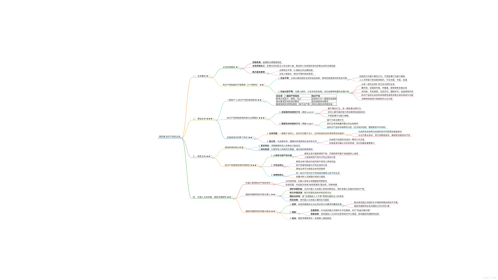

# Agent Skills

A collection of skills for AI agents. Each skill is a self-contained directory that can be copied to your agent's skills directory.

## Example Output



This is an example result from pdf2mindmap.

## Skills

### pdf2mindmap
Convert PDF documents into interactive mind maps with LLM-powered summarization.

**Version:** 1.0.0
**Author:** linton

#### Features
- Automatic chapter detection using PDF bookmarks or font-size heuristics
- LLM summarization with priority markers (★) and memory indicators (◯)
- Interactive mind maps powered by markmap-cli
- High-quality PNG export (8K resolution) with Chinese font support
- Batch processing for large PDFs (100+ chapters)

#### Installation
```bash
pip install pymupdf pyppeteer
npm install -g markmap-cli
```

#### Usage
```bash
# Convert PDF to mindmap
python3 scripts/pdf2mindmap.py your_document.pdf

# Output structure:
# mindmap_your_document/
# ├── markdown/          # LLM-generated markdown files
# ├── output/            # HTML and PNG mind maps
# └── text/              # Raw extracted text
```

#### HTML to PNG Export
```bash
# Batch convert all HTML to PNG
python3 scripts/html2png.py output/ --batch
```

## How to Use

### For Hermes Agent Users

1. Clone this repository:
```bash
git clone https://github.com/LintonCode/agent-skills.git
```

2. Copy the skill directory to your agent's skills folder:
```bash
cp -r agent-skills/pdf2mindmap ~/.hermes/skills/pdf2mindmap
```

3. Install dependencies:
```bash
pip install pymupdf pyppeteer
npm install -g markmap-cli
```

4. Use the skill by invoking it:
```
/pdf2mindmap <path_to_pdf>
```

### For Other AI Agents

Each skill is self-contained with:
- `SKILL.md` - Skill documentation and instructions
- `scripts/` - Executable scripts
- `README.md` - Skill-specific documentation

Simply copy the skill directory to your agent's skills directory and follow the installation instructions in the skill's README.

## License

MIT License - see [LICENSE](LICENSE) for details.

## Contributing

Contributions are welcome! Please feel free to submit a Pull Request.
